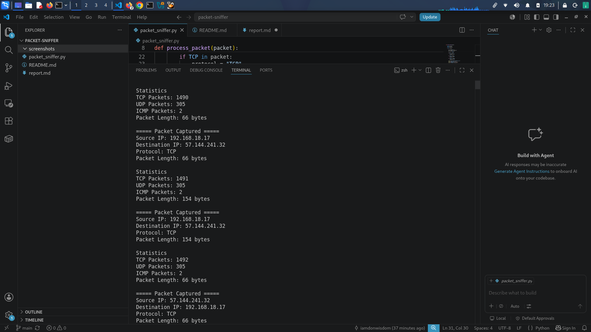
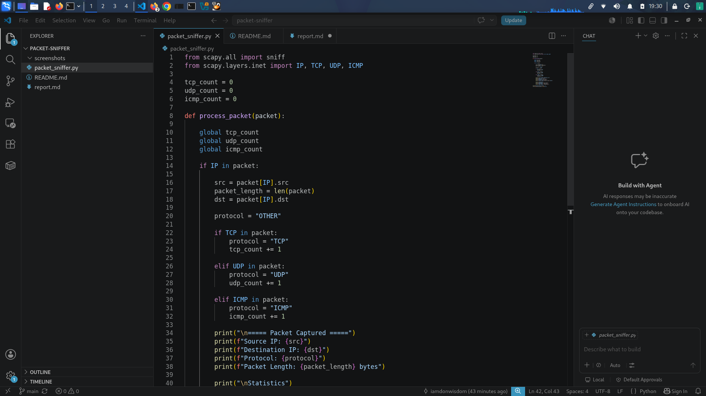
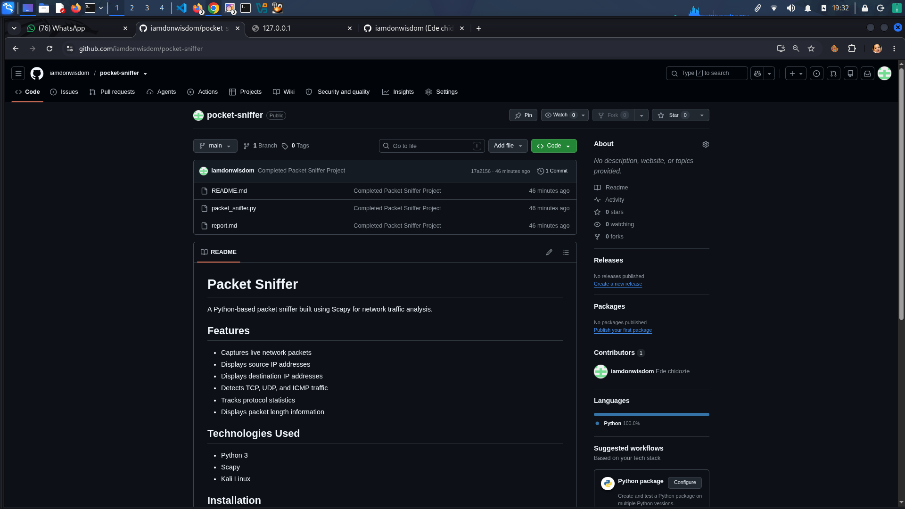

# Packet Sniffer Project Report

## Objective

Develop a packet sniffer capable of capturing and analyzing network traffic in real time.

## Tools Used

- Python
- Scapy
- Kali Linux
- Visual Studio Code

## Features Implemented

- Packet capture
- Source IP extraction
- Destination IP extraction
- Protocol identification
- TCP packet counting
- UDP packet counting
- ICMP packet counting
- Packet length detection

## Results

The packet sniffer successfully captured live network traffic and classified packets based on protocol type while maintaining protocol statistics.

## Screenshots

### Live Packet Capture

### Source Code

### GitHub Repository

## Conclusion

